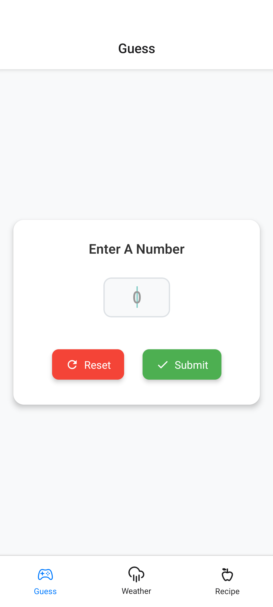
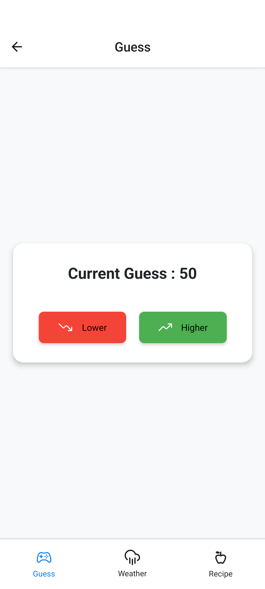
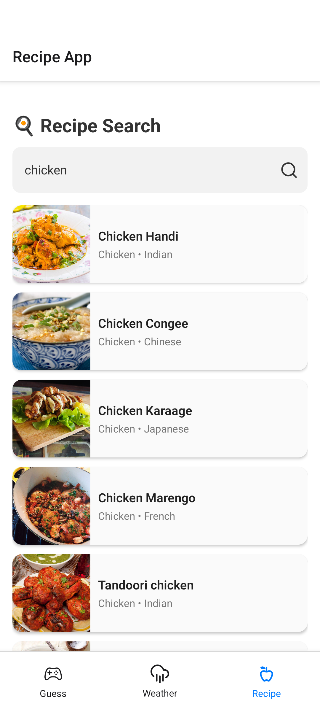
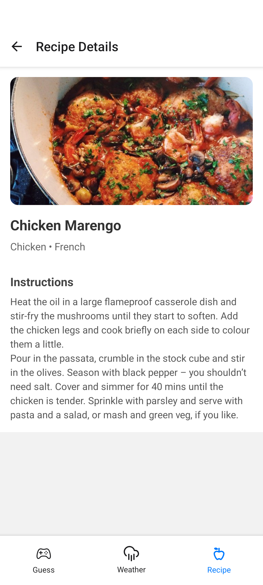
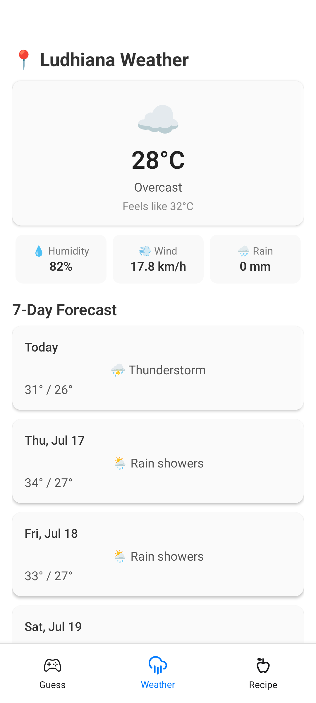

# Minimum React Native App

This is a multi-feature React Native application demonstrating several simple screens and navigation patterns. The app includes:

- Guess the Number game
- Recipe list and details
- Weather information
- Todo list

## Features & Screenshots

### Guess the Number Game
A simple game where the user tries to guess a randomly generated number.

<div style="display: flex; gap: 10px;">
   
   
</div>


### Recipe List & Details
Browse a list of recipes and view details for each recipe.

<div style="display: flex; gap: 10px;">
   
   
</div>


### Weather
Displays current weather information for a selected location.




## Getting Started

1. Install dependencies:
   ```bash
   npm install
   ```
2. Start the Metro bundler:
   ```bash
   npm start
   ```
3. Run on your device or emulator:
   ```bash
   npx expo start
   ```

## Folder Structure
- `components/` - Reusable UI components
- `navigation/` - Navigation setup (Stack, Tab, Recipe routers)
- `screen/` - Main screens for each feature
- `screen/guessthenumber/` - Guess the Number game screens
- `screenshots/` - App screenshots
- `asset/` - App assets (icons, images)

## License
[MIT](LICENSE)
